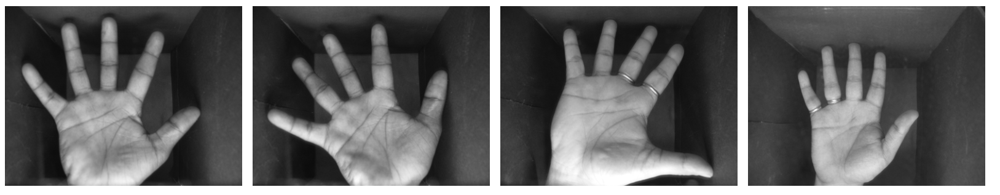
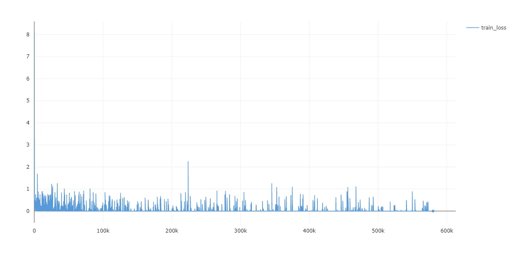
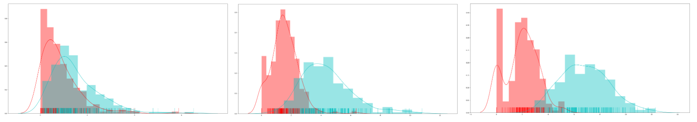

## Palmprint-recognition

​	The traditional palmprint recognition method is to extract the palmprints in the image by constructing features. This method is not accurate enough, and when the scene is not standard, such as strong light, the palm posture changes, the recognition rate will decrease，This project is an example of palmprint recognition based on deep learning, supporting custom models and data for training. The default dataset is IITD(https://www4.comp.polyu.edu.hk/~csajaykr/IITD/Database_Palm.htm), released by Indian institute of Technology.  You can see the detailed introduction and download the data set on the official website.



## Environmental needs(环境)

​	python3.7,  pytorch1.5,  cuda10.2

## Install dependent libraries(安装依赖模块)

```
	pip install -r requirements.txt
```

## Train(训练)

1. Download the IITD palmprint dataset:

2. Train a model by selecting the model name and configuration file(configuration.py). During the training, model will be saved in folder 	checkpoints/model_name

```
	python main.py --model_name
```

By default, model_name is facenet, dataset_name is palmprint_v1. The input images and target mask should be the same format as IITD

## Inference(推理)

​	You can easily test the accuracy of your dataset via the CIL.

​	To predict a single image and get mean distance, You can execute the following command:

```
		python inference.py
```

## Results(结果)

​	Some training parameters and results are as follows:

​	sample 1:

| margin | strict filter |  lr  | epoch |          expermiment_id          |
| :----: | :-----------: | :--: | ----- | :------------------------------: |
|  0.5   |     False     | 1e-2 | 5000  | f2d368d64ebc413192be6560e533c7df |

​	train_loss:

​	pair distance between two classes,  red represents the distance in similar classes, green represents the distance between different classes.

```
             Epoch0                             Epoch1000			            Epoch5000
```




## Todo

add the complete code and other verification
